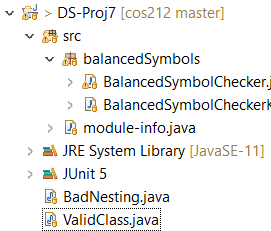

# Project 6 - Keeping your balance

###### Important Note: This assignment covers one of the classic CS homework problems. As such, there are many, many solutions available online. You are not to view any solutions to this problem, whether online, in a textbook, or via your classmates. Copying a solution will not help you learn the concepts at the heart of this assignment. If you need help with anything, contact the professor or attend the free tutor lab.

* This is not group work
* You may look at tutorials for stacks, but not for balanced symbol checking.

###### Helpful Advice: You will save yourself some headache if you take time to plan and design before you start coding. If you just start coding with no plan, you'll find yourself with lots of duplicated code, lots of special cases, and very long, confusing methods. Consider how you could best break this up into small, single purpose methods to avoid duplicating code, producing long and unwieldy methods, or passing around too many parameters.

Build this program method by method, testing as you go.

This project will give you a chance to combine some of our new data structures with some of the activities that we've been doing in class.

You may start with this skeleton that handles file reading for you.  You can hard-code the name of the file you're reading in for the purposes of this assignment.  Note that files you want to read in this way would need to be located in your general project directory, not your src folder, such as like this:

* **Parse the java source file checking to see if parentheses (), braces {} and brackets [] are properly nested and matched**
* Use a stack to keep track of the opening Characters you encounter
* You may use either the Stack class we developed, or the Java Collections API Stack class

* Print out the source file character by character until you find an error
* Point out to the user where you first noticed a problem if there is one

Make sure your error message is easily visible

Make sure your error message clearly identifies what was either missing or extra (or which two symbols don't match each other).  Examples:
* *ERROR: cannot use } to close (*
* *ERROR: Unmatched opening characters: { [*

* You can stop outputting the file once you locate an error
* You only need to report the first error you find (and can assume that the entire file is erroneous after that point
* Closing symbols that are missing are still errors. If there are unmatched symbols, you still need to output a message to the user about the error. 
* If you reach the end of a file and there are no imbalances, print out a final message of "Balanced!"

**Recommendation:** Before doing any development, try simply reading in any sample file and printing it back out again character by character

Example valid files (that wouldn't compile, but are balanced) could consist of the following: (try putting one line of text into a file at a time)
* { ( [ ] ) { } }
* {}
* hello
* ( { } )

Example invalid files (that are unbalanced) would include files consisting of one of these lines:
* { ( } )
* { } }
* [ [ ]
* ( }

**Completing the requirements up to this point will get you 24/30 points.** Please save a separate copy of your working code at this point before attempting to do the additional requirements. If you do not complete the additional requirements, please turn in your working code for the basic requirements rather than broken code for the additional requirements

---

**For a chance at 30/30,** you must also deal properly with Strings and Comments

* Any characters inside of a String literal don't count against your balance
* Remember that you can have a quotation mark inside of a string literal by escaping it
* Any characters inside of a comment don't count against your balance
* This includes line comments // as well as block comments /* */
* Be able to deal with files that may or may not include braces, brackets and parentheses inside of * * * String literals and comments
* Also be able to deal with files that do not have properly closed String literals or comments (which would count as unbalanced)

**Basic point breakdown:**
* 5pts: Basic parsing and printing
* 5pts: Appropriate error messages
* 12pts: Balance checking of (), {} and []
* 2pts: Following proper coding and documentation standards
* 6pts: String and comment balancing

